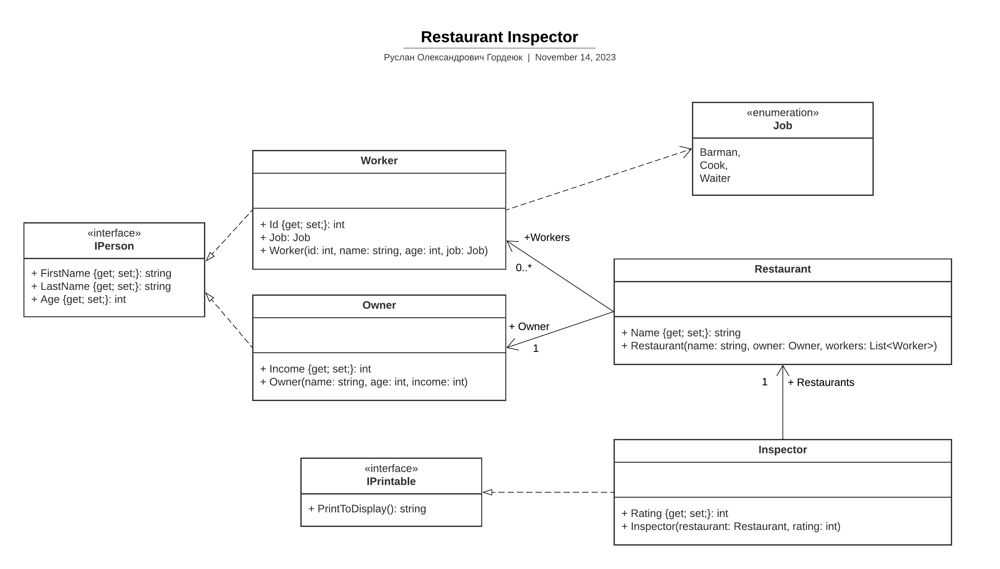

# Restaurant Inspectror

**Ідея проекту**: Ми інспектор ресторанів котрий ставить оцінки, від 0 до 10

Діаграма класу:

## Опис класів

- Inspector - ставимо оцінку ресторану
- Restaurant - привласнюємо назву ресторану та визначаємо власника із робітниками
- Owner - привласнюємо ім'я, прізвище та вік, визначаємо дохід власника
- Worker - ставимо id, привласнюємо ім'я, прізвище та вік, визначаємо вид роботи

## Опис методів

- PrintToDisplay - повертає рядок який потім виводиться через Console.WriteLine()
